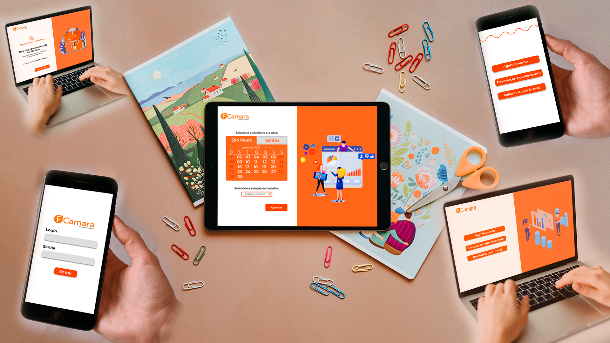
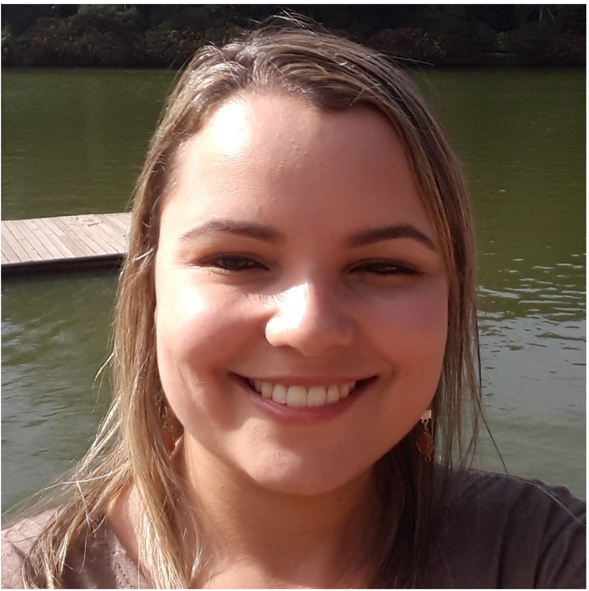
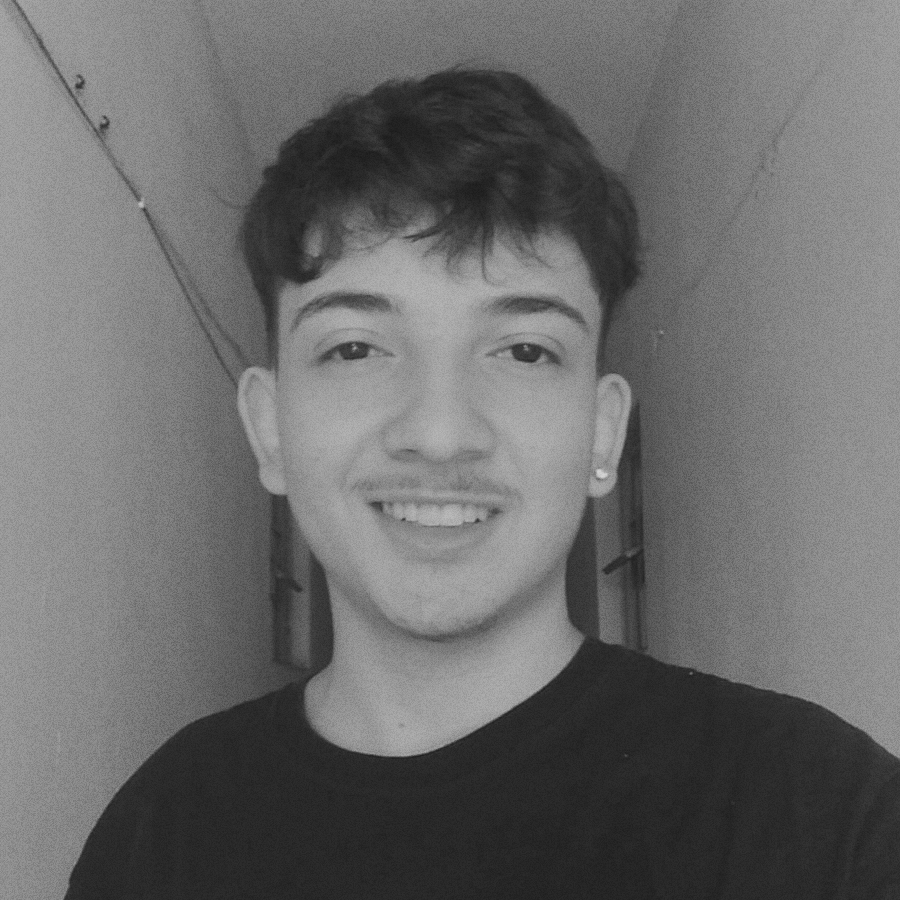

# My turn - SQUAD 8 :rocket: :sparkles:

<h1 align="center">
    
</h1>

<ol>
    <li><a href="#sobre">Sobre</a></li>
        <li> <a href="#especificacoes">Especificações</a></li>
        <li> <a href="#comorodaroprojeto">Como Rodar o Projeto?</a> </li>
        <li> <a href="#resultados"> Resultados de Desenvolvimento</a> </li>
        <li> <a href="#features">Features</a> </li>
        <li> <a href="#conteudoxterno">Conteúdo externo</a></li>
        <li> <a href="#nossaequipe">Nossa Equipe</a></li>
    <li><a href="#licencas">Licença</a></li>
</ol>

<h2 id="sobre">Sobre</h2> 

O My Turn foi um projeto desenvolvido pelo Squad 8 para o Hackathon do Programa de Formação da [FCamara](https://digital.fcamara.com.br/programadeformacao). O objetivo desse projeto foi a construção de uma ferramenta que possa auxiliar a empresa na reabertura de seus escritórios. No My Turn, os consultores da empresa poderão fazer o login na plataforma a fim de realizarem agendamento dos dias em que quiserem trabalhar presencialmente, escolhendo a estação de trabalho (Santos ou São Paulo) e a mesa de sua preferência. Tudo isso respeitando a capacidade dos escritórios e regras de distanciamento social. 

<h2 id="especificacoes">Especificações</h2> 

Utilizamos Node.js com Express para criar o backend da aplicação, codificado no sentido de repassar dados estáticos para consumo de uma API. Essa integração entre backend e frontend foi realizada utilizando a biblioteca Axios, utilizamos também a possibilidade de autenticação utilizando JWT. Na estilização do frontend utilizamos CSS puro no intuito de termos mais flexibilidade para compor os layouts. O código foi criado a partir da biblioteca React com o uso do Typescript para criação das interfaces dinâmicas e que trouxessem a melhor experiência de navegação possível ao usuário.

<h2 id="comorodaroprojeto">Como rodar o projeto?</h2>

``` bash
#Clone este repositório
$ git clone git@github.com:lilianmartinsfritzen/projeto-squad-8.git

#Abra a pasta backend e no terminal execute o comando:
$ npm install
ou
$ yarn install

#Em seguida deixe a aplicação “rodando” através do comando abaixo:
$ npm start
ou
$ yarn start

#A aplicação (backend) será aberta na porta:3333 - acesse http://localhost:3333. 

#Na pasta frontend abra o terminal e execute o comando:
$ npm install
ou
$ yarn install

#Em seguida deixe a aplicação “rodando” através do comando abaixo:
$ npm start
ou
$ yarn start

#A aplicação(frontend) será aberta na porta:3000 - acesse http://localhost:3000. 
```
*OBS: Para que a aplicação funcione corretamente, você deve deixar o front e o back rodando ao mesmo tempo.*

``` bash
#Abaixo estão os dados fictícios de e-mail e senha para a navegação das telas:

email: usuario@fcamara.com.br
senha: 123456

```

<h2 id="resultados">Resultados de Desenvolvimento</h2>
* Implementação do desing da interface com HTML e CSS usando a componentização do React
* Aplicação de Responsividade nas Telas
* Criação de um calendário funcional
* Autenticação

[Detalhamento dos resultados](resultados-desenvolvimento.md)

<h2 id="features">Features</h2>

* O que será que pensamos para o futuro da nossa aplicação...? :sunglasses:
    * **01** - Criação de banco de dados dinâmico utilizando modelo conceitual e em camadas.
    * **02** - Criação de perfil do administrador.
    * **03** - Emissão de relatórios de ocupação (acesso para o perfil de administrador).

<h2 id="conteudoxterno">Conteúdo Externo</h2> 

* :wink: Ficou curioso e quer saber como foi a idealização do My Turn de maneira rápida? Se liga no nosso [vídeo de funcionalidades](https://youtu.be/v7VXScbpCMg)! 
* :black_nib: Também foi escrito um [artigo](https://medium.com/@anapssouza/voltando-ao-escrit%C3%B3rio-em-seguran%C3%A7a-estudo-de-caso-fcamara-bbdf6de9a00e) relatando todo o processo de desenvolvimento feito pela nossa dupla de UX Design. 
* :yellow_heart: Nosso [Pitch](https://drive.google.com/file/d/1BqQAbJBO9QZUIt8zK1JFG_LoLW7MZW79/view?usp=sharing).

<h2 id="nossaequipe">Nossa Equipe</h2> 


|:woman_cartwheeling:|Nome|*No Programa de Formação eu...*|Contatos|
|--|--|:--:|--|
|<br>*UX Designer*| Ana Paula Souto| *"...Vi que em 14 dias é possível aprender e passar por milhares de coisas, desde trabalhar na prática com um squad, reconhecer as minhas funções e entender as de cada um, até fazer grandes amizades e conhecer grandes potenciais"* | [Linkedin](https://www.linkedin.com/in/ana-paula-souto-de-souza-a496681a4) [Email](anapssouza@live.com)
|<br>*Desenvolvedora*| Eirene Fireman | *"...Descobri que CSS é bem mais difícil do que aparenta ser, saí do 0 com React a "até que sei alguma coisa", e percebi, na prática, a importância de fazer com que uma aplicação atenda o maior número possível de usuários. Além disso, pude enfrentar desafios super inesperados ao lado de uma equipe sensacional na qual todos exerceram seus papéis com excelência!"* | [Github](https://github.com/eireneof) [Linkedin](https://www.linkedin.com/in/eirene-fireman-16384618b/) [Email](eof@ic.ufal.br) |
| <br>*Desenvolvedora* | Lílian Martins Fritzen | *"...Senti que tudo passou a fazer mais sentido quando conheci o Pai Flex-Box, amei a liberdade que ele dá a seus filhos. React com suas possibilidades delicinhas e o Typescript, ahh esse sim, tinhoso que só, mas gosto também. De nomes diferentes de restaurantes a vontade de encontrar essa equipe maravilhosa, Squad-8, vocês só reforçaram o quanto escuta ativa, comprometimento e empatia fazem qualquer projeto ser um sucesso. Obrigada!"* | [Github](https://github.com/lilianmartinsfritzen) [Linkedin](https://www.linkedin.com/in/lilian-martins-fritzen/) [Email](liliancmartinsfritzen@gmail.com) |
| <br>*UX Designer* | Pedro Emerenciano | *"...Co-criei com pessoas incríveis, aprendi a trabalhar mais em equipe e que 15 dias passam voando!"* | [Linkedin](https://www.linkedin.com/in/pedro-emerenciano/) [Email](pemerenciano@outlook.com)

<hr>

<p style="text-align:center;">Feito com muito 🧡 pelo Squad-8<br> #FuturosSangueLaranja 🚀</p>