# Detalhamento dos resultados de desenvolvimento do Squad-8 

<ol>
    <li><a href="#resultados">O que foi feito?</a></li>
        <li> <a href="#desing-interface">Implementação do desing da interface</a></li>
        <li> <a href="#responsividade">Aplicação de Responsividade</a> </li>
        <li> <a href="#calendario">Calendário Funcional</a> </li>
        <li> <a href="#autenticacao"> Autenticação </a> </li>
</ol>

<h2 id="desing-interface">Implementação do desing da interface</h2>

A implementação desing da interface seguiu o que foi proposto pela equipe de UX, a partir da visualização do [protótipo](https://www.figma.com/file/czNpnDcxajtwgCeWWLVXQq/Protótipos-Interface-FCamara?node-id=0%3A1) feito no Figma. Para isso, foi utilizado HTML e CSS dentro da aplicação em React (typescript). Como a maioria das páginas obedece um padrão que pudemos chamar de `white-box` e `orange-box`, foi criado uma folha de estilo padrão para a maioria dos componentes, a `pattern.css`. Além dela, cada página tinha sua folha de estilo própria de acordo com suas necessidades específicas. 

Resultados: 

* **Login:**

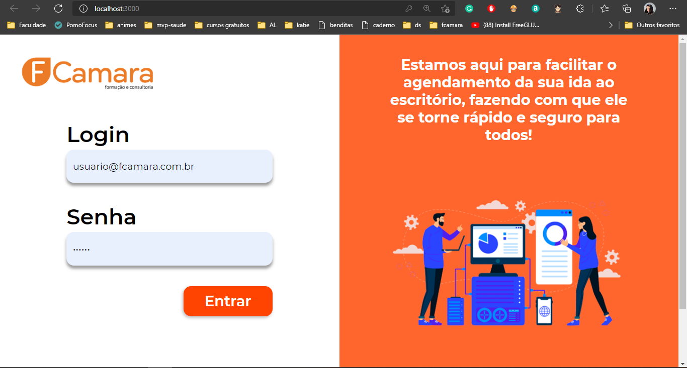

* **Dashboard:**

* **Página de Agendamento:**

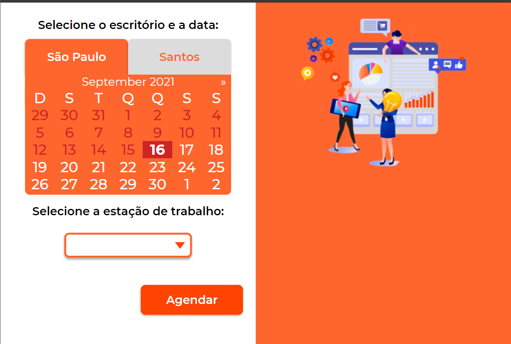
*obs: como a página inteira não cabe em um print, aqui só está mostrando a parte principal da página*

* **Página de Confirmação do Agendamento:**

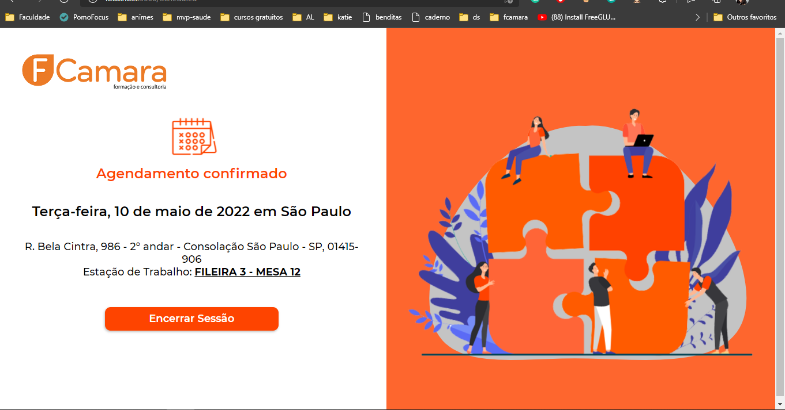

* **Página de Cancelar Agendamento:**

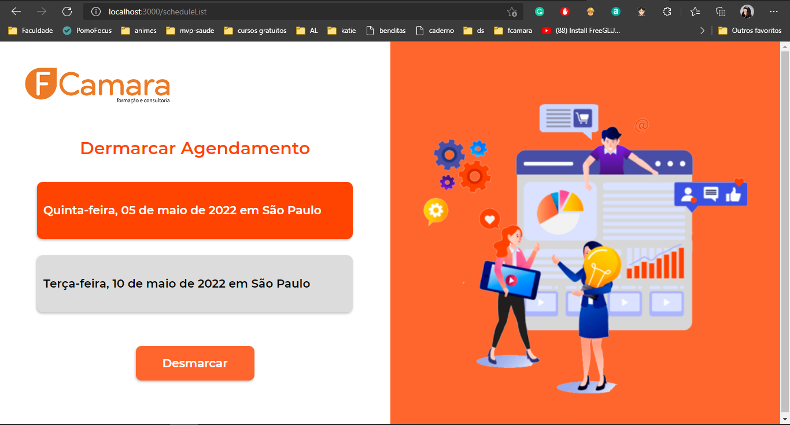

* **Página de Confirmação do Cancelamento**

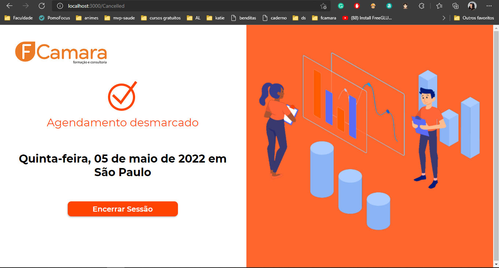

<h2 id="responsividade">Aplicação de Responsividade</h2>

Para a aplicação de responsividade na página, foi utilizado um padrão de tamanhos passado pelos UX's.
 * *1980px* - Resolução Full Desktop
 * *1200px* - Resolução Mínima Desktop
 * *720px* - Resolução Mínima Tablet
 * *320px* - Resolução Mínima Mobile

Além desse padrão, a implementação do desing da interface foi constantemente testada na ferramente de responsividade do Crhome para verificar se ela estaria respondendo a diferentes tipos de medidas. É interessante notar que no protótipo do Figma, existem dois tipos de desing, uma versão mobile e outra desktop. Isso também foi implementado. Como resultados para a parte de responsividade, temos uma aplicação que já consegue se adaptar a muitos formatos diferentes de tela, ou seja, todas as telas estão responsivas. Como pode ser visto, com o exemplo de duas telas, a seguir: 

* **Página Agendamento**:  

* *1440px*
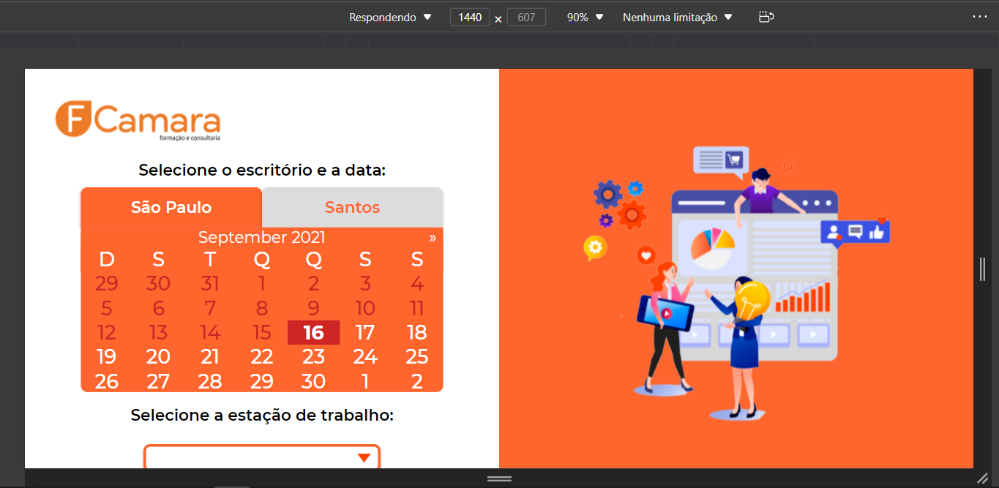

* *786px*
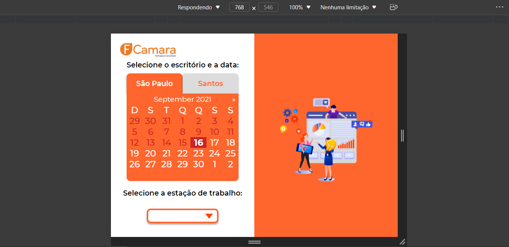

* *411x824px (Pixel 2 XL)*
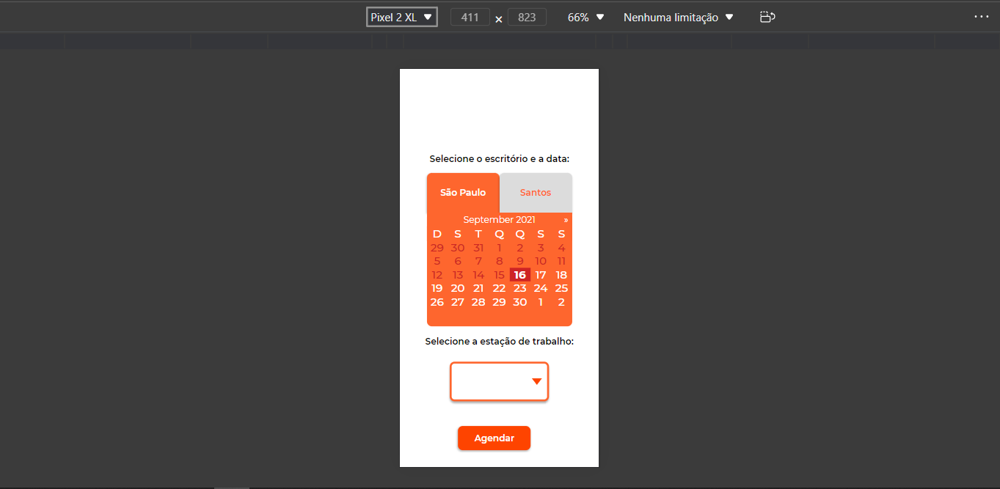

* **Página de Cancelar Agendamento:**

* *1024px*
 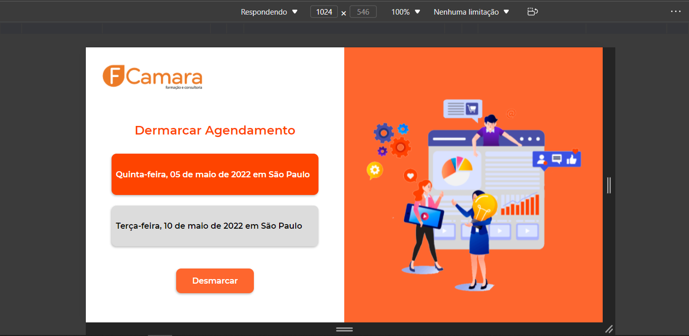

* *786px*
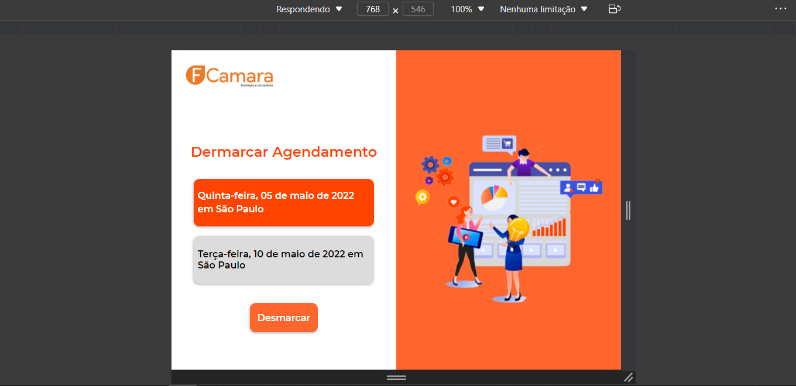

* *375x667px (IPhone 6/7/8)*
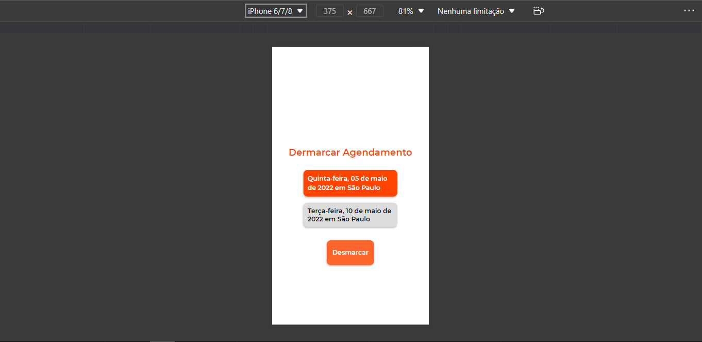

<h2 id="calendario">Calendário Funcional</h2>

Neste caso decidimos criar o nosso próprio DatePicker, essa necessidade surgiu a partir de duas vontades, a primeira era de ter maior liberdade na hora de estilizar o coração do nosso projeto e a segunda foi exatamente o fato de podermos aplicar uma estrutura lógica que nos retornasse um calendário dinâmico e responsivo. 
Ao pensarmos na estrutura de dados que melhor representaria o calendário; que é composto por um agrupamento de semanas, e que por sua vez está diluído em conjuntos de 7 dias, entendemos que talvez a melhor estrutura para exibi-lo seria por meio de arrays. A biblioteca utilizada para lidar com as datas foi a Moment.JS, entretanto, sabíamos que objetos de data no JS são mutáveis, desta forma tomamos o cuidado de criarmos cópias destes objetos antes de exibi-los. Implementar em código os hooks oferecidos pela biblioteca React trouxe exatamente a fluidez e resposta que gostaríamos ao transitar pelos dias e meses. Aprendemos muito sobre React ao implementarmos a lógica desta parte do projeto.

<h2 id="autenticacao">Autenticação </h2>

Implementação do processo de autenticação, autorização e refresh token dentro do React com uso da JSON Web Token (JWT), com tokens assinados usando uma chave pública/privada ou um segredo privado. Este formato é um padrão da internet para a criação de dados com assinatura opcional e/ou criptografia cujo payload contém o JSON, afirmando, por sua vez, algum número de declarações. Estes processos nos permitem controlar o acesso à rotas e componentes tanto no client-side quanto no server-side. Utilização da biblioteca nookies para uma melhor integração ao salvar os tokens nos cookies. A implementação completa deste processo nos traz a possibilidade de recuperar o estado da autenticação, realizar o refresh do token, manter uma fila de requisições no Axios e, também, a realização do logout automático.

Feito com muito 🧡 pelo Squad-8  #FuturosSangueLaranja 🚀
